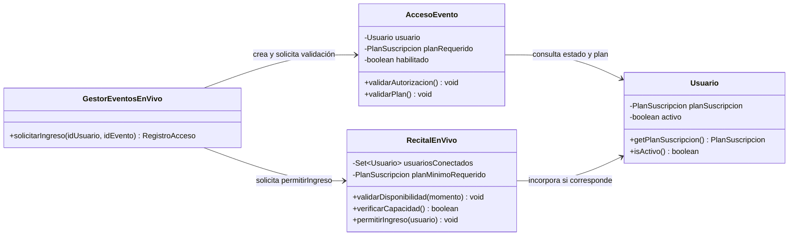
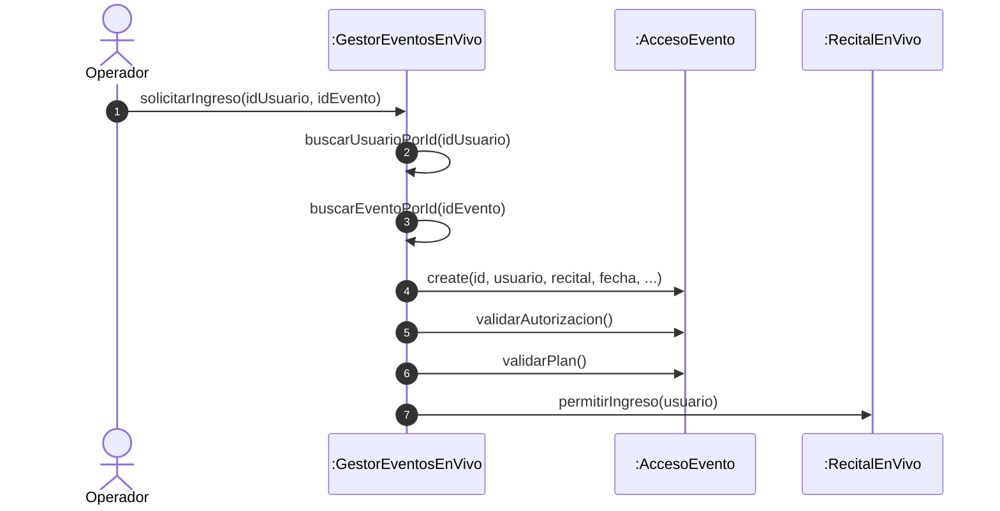
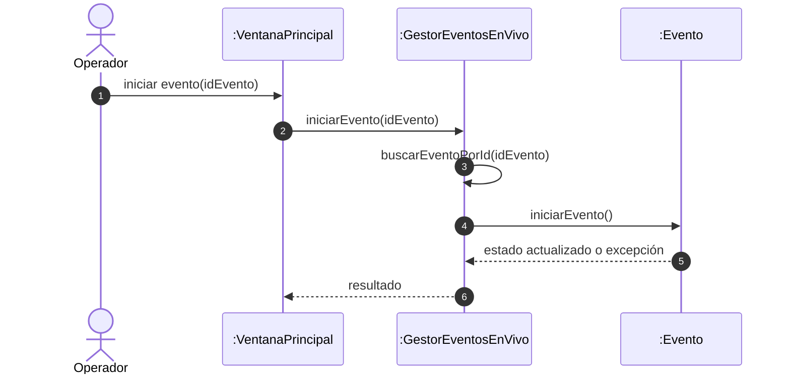
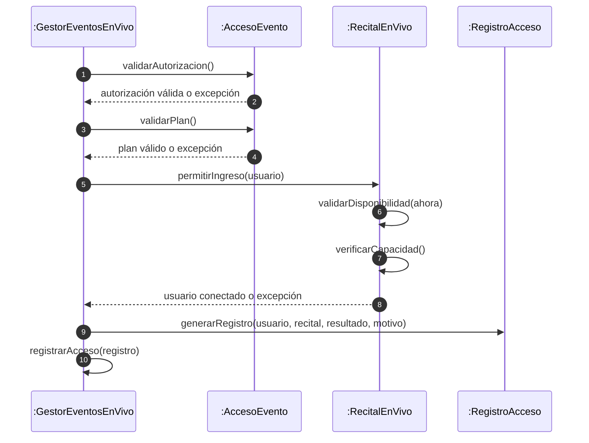
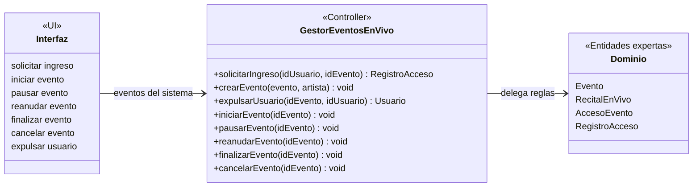
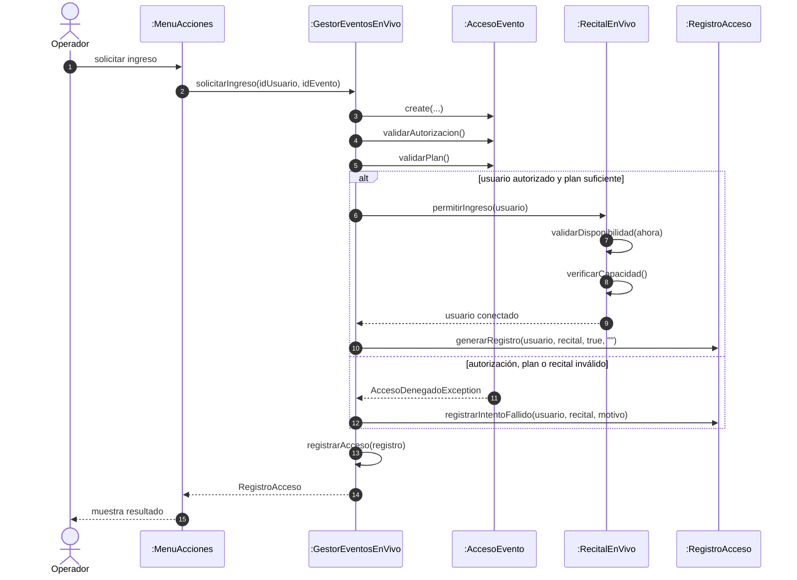

# Diagramas de interacción GRASP

Los siguientes diagramas siguen el formato de los ejemplos del PDF: plantean una responsabilidad y muestran el paso de mensajes entre objetos para resolverla.

## 1. Experto en información

**Pregunta:** ¿Quién debe decidir si un usuario puede ingresar a un recital?

La respuesta no corresponde a un único objeto. `AccesoEvento` es experto en autorización y plan; `RecitalEnVivo` es experto en disponibilidad, capacidad y usuarios conectados. `GestorEventosEnVivo` solamente coordina el caso de uso.

## 2. Creador

**Pregunta:** ¿Quién debe crear un `AccesoEvento` para procesar una solicitud de ingreso?

`GestorEventosEnVivo` es el creador apropiado porque administra los eventos, usuarios y el identificador incremental del acceso; además utiliza el objeto recién creado para coordinar la validación.

## 3. Bajo acoplamiento

**Pregunta:** ¿Cómo evitar que la interfaz conozca las reglas internas de un evento?

La alternativa preferida es que la interfaz solicite la acción al gestor y el gestor delegue en el evento. La interfaz no necesita conocer estados válidos ni controlar excepciones de dominio directamente.

> Esto ya es lo que hace el código: `VentanaPrincipal.cambiarEstadoSeleccionado` y `MenuAcciones.ejecutarCambioDeEstado` llaman a `gestor.iniciarEvento/pausarEvento/reanudarEvento/finalizarEvento/cancelarEvento(idEvento)`, nunca a los métodos de `Evento` directamente.

## 4. Alta cohesión

**Pregunta:** ¿Quién debe realizar cada parte de `solicitarIngreso`?

El gestor conserva una responsabilidad cohesionada cuando coordina, sin asumir las validaciones que pertenecen a los objetos expertos.

## 5. Controlador

**Pregunta:** ¿Qué objeto recibe los eventos del sistema y coordina el caso de uso?

`GestorEventosEnVivo` representa el subsistema de eventos y funciona como fachada de dominio entre consola/Swing y las entidades.

## Secuencia completa: ingreso autorizado o rechazado

