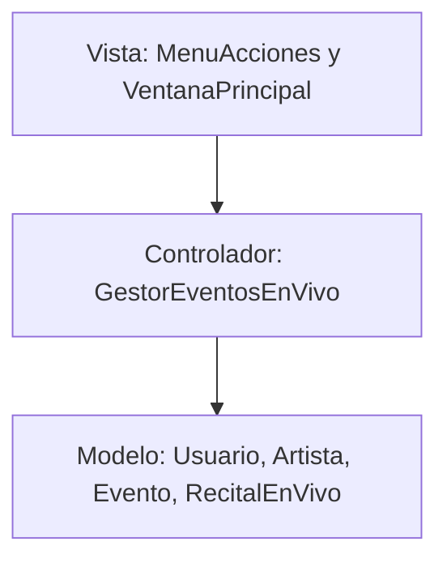
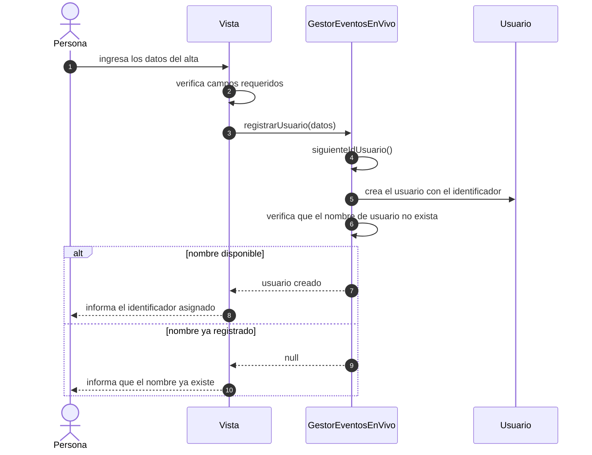

# Iteración 3: arquitectura Modelo Vista Controlador

Módulo: UADE Beats, acceso a eventos en vivo

## 1. Problema detectado

Ambas vistas, la de consola (`MenuAcciones`) y la ventana Swing (`VentanaPrincipal`), construían directamente objetos del modelo con `new Usuario`, `new Artista` y `new RecitalEnVivo`, y calculaban por su cuenta el identificador de cada entidad. La consola lo resolvía con contadores estáticos que debía recalcular al cargar datos de archivo, y la ventana con tres métodos propios que recorrían las listas. La misma regla estaba implementada dos veces con mecanismos distintos, y las vistas dependían de los constructores del modelo.

## 2. Distribución en MVC

| Componente | Clases | Responsabilidad |
|---|---|---|
| Modelo | Paquete `modelo` | Datos y reglas de negocio. No conoce la consola ni la ventana. |
| Vista | `MenuAcciones` y `VentanaPrincipal` | Reunir los datos que ingresa la persona, verificar que los campos requeridos estén completos, mostrar resultados y enviar cada acción al controlador. |
| Controlador | `GestorEventosEnVivo` | Recibir los pedidos de la vista, crear los objetos del modelo, asignar identificadores y devolver el resultado. |



La vista conoce al controlador y muestra los objetos que este le devuelve. El controlador conoce al modelo. El modelo no depende de ninguna de las otras capas.

## 3. Cambios aplicados

### Alta de entidades en el controlador

`GestorEventosEnVivo` incorpora tres operaciones de alta que reciben los datos ya reunidos por la vista y devuelven el objeto creado.

| Operación | Datos que recibe | Resultado |
|---|---|---|
| `registrarUsuario` | Nombre de usuario, nombre, apellido, email, contraseña y plan | El usuario creado, o `null` si el nombre de usuario ya existe |
| `registrarArtista` | Nombre artístico, género, biografía y verificación | El artista creado |
| `crearEvento` | `DatosRecital` y artista asociado | El recital creado y asociado al artista |

### Asignación de identificadores

El identificador siguiente se calcula en el controlador como el mayor existente más uno. El controlador es quien conoce las colecciones de usuarios, artistas y eventos, por lo que el valor es correcto aunque los datos provengan de un archivo. Este cálculo reemplaza los contadores estáticos de la consola, el método que los recalculaba al cargar datos y los tres métodos equivalentes de la ventana.

### Vistas

| Vista | Antes | Después |
|---|---|---|
| `MenuAcciones` | Tres contadores estáticos, un método para recalcularlos y tres construcciones directas de objetos del modelo | Solicita el alta al controlador e informa el identificador del objeto devuelto |
| `VentanaPrincipal` | Tres métodos de cálculo de identificador y tres construcciones directas | Solicita el alta al controlador y refresca las listas |

### Flujo del alta de un usuario



## 4. Reparto de validaciones

| Capa | Validación |
|---|---|
| Vista | Campos requeridos completos y valores numéricos bien formados |
| Controlador | Unicidad del nombre de usuario |
| Modelo | Reglas de negocio: estado y horario del evento, capacidad, plan mínimo y transiciones de estado |

## 5. Patrones y principios aplicados

| Elemento | Aplicación |
|---|---|
| MVC | Separación de Modelo, Vista y Controlador. |
| Controlador (GRASP) | El alta de entidades se suma a las operaciones que el gestor ya coordinaba. |
| Creador (GRASP) | Quien administra las colecciones es quien crea sus elementos. |
| Experto en información (GRASP) | El identificador se calcula donde está la información necesaria. |
| Bajo acoplamiento (GRASP) | Las vistas dejan de depender de los constructores del modelo. |
| Código duplicado | Desaparece la doble implementación del cálculo de identificadores. |

## 6. Decisión de diseño

El cálculo del identificador se ubicó en el controlador y no en las vistas ni en el modelo, porque depende del conjunto de entidades existentes, información que solo conoce el controlador.

## 7. Ejecución

Desde `TP/Grupo9_POO_EntregaFinal/Codigo/src`:

```
javac -d ../out $(find . -name "*.java")
java -cp ../out Main
java -cp ../out app.AppSwing
```

La primera ejecución usa la consola y la segunda abre la ventana gráfica.
